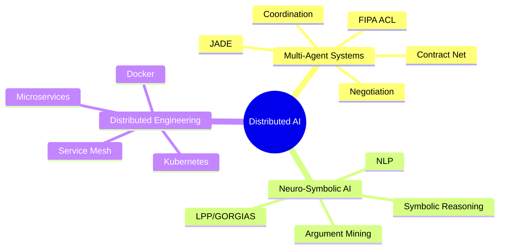

<div align="center">

### Future M2 Student in Distributed Artificial Intelligence

I build intelligent systems where **agents cooperate, negotiate and make decisions**, supported by reliable distributed architectures.

[](https://www.linkedin.com/in/noureddine-mohammedi)
[](mailto:mohammedinoredine@gmail.com)
[](https://github.com/Mr-Noredine)

</div>

---

## `01 / PROFILE`

```text
Field        Distributed Artificial Intelligence
Focus        Multi-Agent Systems, coordination and automated negotiation
Objective    Six-month M2 internship during the second semester
Location     France
```

I am a computer science student preparing to enter an **M2 in Distributed Artificial Intelligence**. My work combines autonomous agents, symbolic reasoning, machine learning, NLP and distributed software engineering.

## `02 / CURRENT MISSION`

> Seeking a **six-month internship** in **Distributed AI and Multi-Agent Systems**.

- Autonomous and cooperative agents
- Agent communication and negotiation protocols
- Collective decision-making and coordination
- Agentic AI and intelligent distributed applications
- Symbolic reasoning, argumentation and NLP
- Scalable architectures for AI systems

## `03 / FEATURED SYSTEMS`

### [TrainMind — Multi-Agent Negotiation System](https://github.com/Mr-Noredine/trainmind-multi-agent-negotiation)

A distributed decision-making system developed with **Java and JADE**. Performance and Recovery agents negotiate a safe training plan using **FIPA ACL** and an iterative **Contract Net Protocol**.

`Java` `JADE` `FIPA ACL` `Contract Net` `Multi-Agent Systems`

### [LPP Argument Mining — Neuro-Symbolic Argumentation](https://github.com/thmsgo18/lpp-argument-mining)

Research project completed with [Thomas Gourmelen](https://github.com/thmsgo18) as part of the **ANR GRAIL** project. We studied how argumentative texts can be transformed into **LPP/GORGIAS** representations, designed an LLM-based annotation prompt for brat corpora, and developed a Python/Graphviz pipeline that converts `.ann` annotations into structured argumentation graphs.

`Python` `NLP` `Argument Mining` `Symbolic AI` `LPP/GORGIAS` `Prompt Engineering` `Graphviz`

### [TCF Prep — Cloud-Native Microservices](https://github.com/Mr-Noredine/tcf-prep-microservices)

An educational platform structured as independent services and deployed with container orchestration and service-mesh security mechanisms.

`Node.js` `React` `PostgreSQL` `Docker` `Kubernetes` `Istio`

### [Abstract Argumentation Solver](https://github.com/Mr-Noredine/abstract-argumentation-solver)

A Python solver for Dung abstract argumentation frameworks, including extension verification and credulous or sceptical acceptance.

`Python` `Symbolic AI` `Automated Reasoning`

### [Shape Classification — KNN and K-means](https://github.com/Mr-Noredine/shape-classification-knn-kmeans)

A recognition pipeline comparing supervised and unsupervised learning with feature descriptors, PCA and classification metrics.

`Python` `scikit-learn` `KNN` `K-means` `PCA`

### [Information Retrieval Engine](https://github.com/Mr-Noredine/information-retrieval-engine)

An end-to-end information retrieval workflow covering ranking, evaluation and experimentation.

`Python` `Jupyter` `Information Retrieval` `Ranking Metrics`

## `04 / TECHNICAL STACK`

### Languages


### AI, ML and Data


### Backend, Web and Data


### Distributed Systems and DevOps


## `05 / CORE KNOWLEDGE`



## `06 / CONTACT`

<div align="center">

**Open to internship opportunities, research-oriented projects and technical collaborations in Distributed AI.**

[mohammedinoredine@gmail.com](mailto:mohammedinoredine@gmail.com) · [LinkedIn](https://www.linkedin.com/in/noureddine-mohammedi) · [GitHub](https://github.com/Mr-Noredine)

</div>

