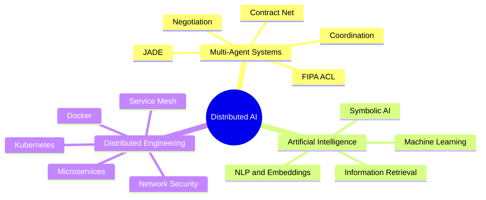

<div align="center">


### Future M2 Student in Distributed Artificial Intelligence

I build intelligent systems where **agents cooperate, negotiate and make decisions**, supported by reliable distributed architectures.

[](https://www.linkedin.com/in/noureddine-mohammedi)
[](mailto:mohammedinoredine@gmail.com)
[](https://github.com/Mr-Noredine)

</div>

---

## `01 / PROFILE`

```text
Field        Distributed Artificial Intelligence
Focus        Multi-Agent Systems, coordination and automated negotiation
Objective    Six-month M2 internship during the second semester
Location     France
Mindset      Build, experiment, evaluate, improve
```

I am a computer science student preparing to enter an **M2 in Distributed Artificial Intelligence**. My work combines artificial intelligence, autonomous agents, symbolic reasoning, machine learning and distributed software engineering.

I am particularly interested in systems composed of multiple intelligent entities capable of communicating, coordinating their actions, resolving conflicts and reaching collective decisions.

## `02 / CURRENT MISSION`

> Seeking a **six-month internship** in **Distributed AI and Multi-Agent Systems**.

Topics I want to work on:

- autonomous and cooperative agents;
- agent communication and negotiation protocols;
- collective decision-making and coordination;
- agentic AI and intelligent distributed applications;
- symbolic reasoning and argumentation;
- scalable architectures for AI systems.

## `03 / FEATURED SYSTEMS`

### 🤖 [TrainMind — Multi-Agent Negotiation System](https://github.com/Mr-Noredine/trainmind-multi-agent-negotiation)

A distributed decision-making system developed with **Java and JADE**. Specialized Performance and Recovery agents negotiate a safe training plan through **FIPA ACL** messages and an iterative **Contract Net Protocol**.

`Java` `JADE` `FIPA ACL` `Contract Net` `Multi-Agent Systems` `Automated Negotiation`

### ☁️ [TCF Prep — Cloud-Native Microservices](https://github.com/Mr-Noredine/tcf-prep-microservices)

A microservices-based educational platform with independent authentication and quiz services, containerized and orchestrated using Kubernetes, with ingress and service-mesh security mechanisms.

`Node.js` `React` `PostgreSQL` `Docker` `Kubernetes` `Istio` `RBAC` `NetworkPolicies`

### 🧠 [Abstract Argumentation Solver](https://github.com/Mr-Noredine/abstract-argumentation-solver)

A Python solver for Dung abstract argumentation frameworks supporting extension verification and credulous or sceptical acceptance under preferred and stable semantics.

`Python` `Symbolic AI` `Automated Reasoning` `Argumentation Theory`

### 📊 [Shape Classification — KNN and K-means](https://github.com/Mr-Noredine/shape-classification-knn-kmeans)

A recognition pipeline comparing supervised and unsupervised learning using multiple feature descriptors, PCA and detailed classification metrics.

`Python` `scikit-learn` `KNN` `K-means` `PCA` `Matplotlib`

### 🔎 [Information Retrieval Engine](https://github.com/Mr-Noredine/information-retrieval-engine)

An end-to-end information retrieval workflow covering ranking, evaluation, experimentation and submission generation.

`Python` `Jupyter` `Information Retrieval` `Ranking Metrics` `Data Analysis`

## `04 / ENGINEERING MATRIX`

<table>
<tr>
<td valign="top" width="50%">

### Languages


### AI, ML and Data


</td>
<td valign="top" width="50%">

### Backend and APIs


### Frontend


### Databases


### Distributed Systems and DevOps


</td>
</tr>
</table>

## `05 / CORE KNOWLEDGE`



## `06 / GITHUB SIGNAL`

<div align="center">


</div>

## `07 / CONTACT`

<div align="center">

**Open to internship opportunities, research-oriented projects and technical collaborations in Distributed AI.**

📧 [mohammedinoredine@gmail.com](mailto:mohammedinoredine@gmail.com)  
💼 [linkedin.com/in/noureddine-mohammedi](https://www.linkedin.com/in/noureddine-mohammedi)  
💻 [github.com/Mr-Noredine](https://github.com/Mr-Noredine)


</div>
